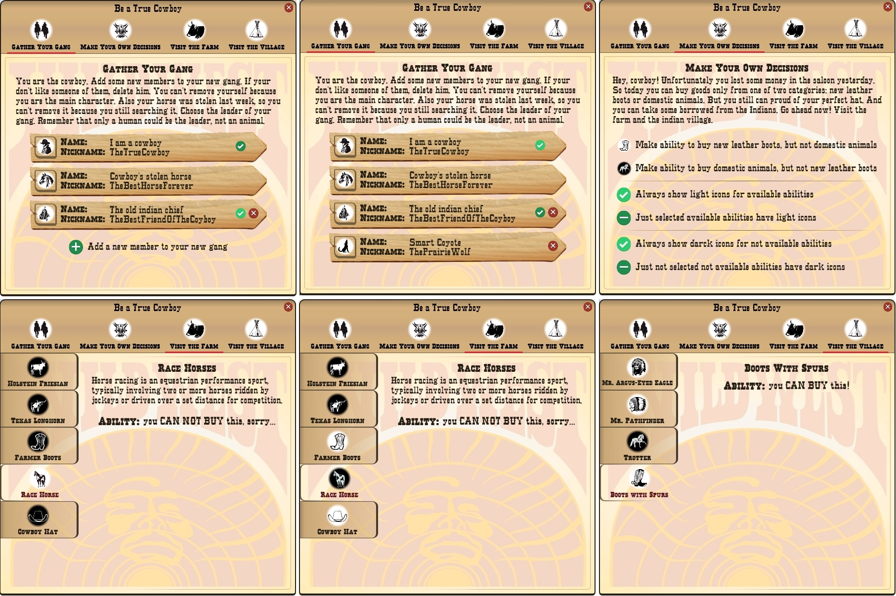
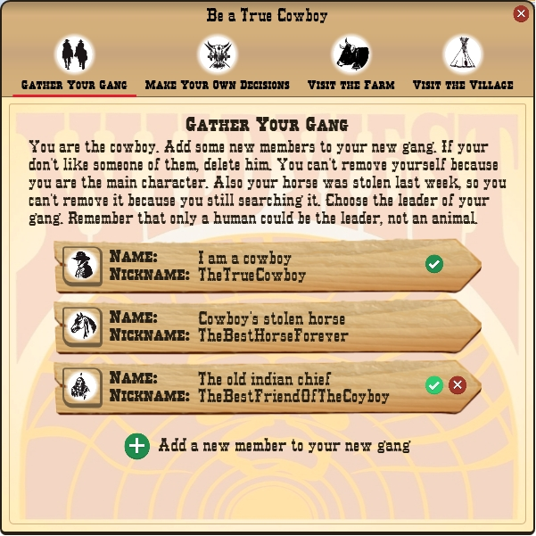
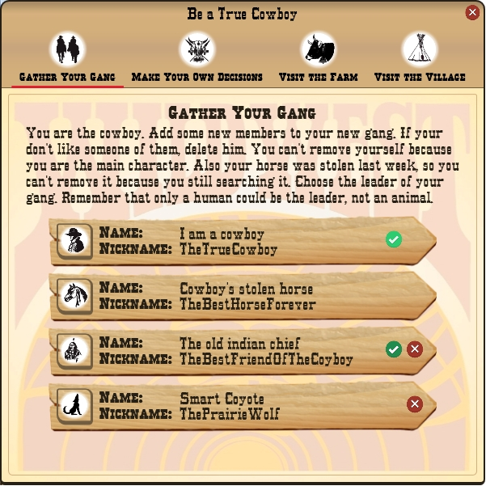
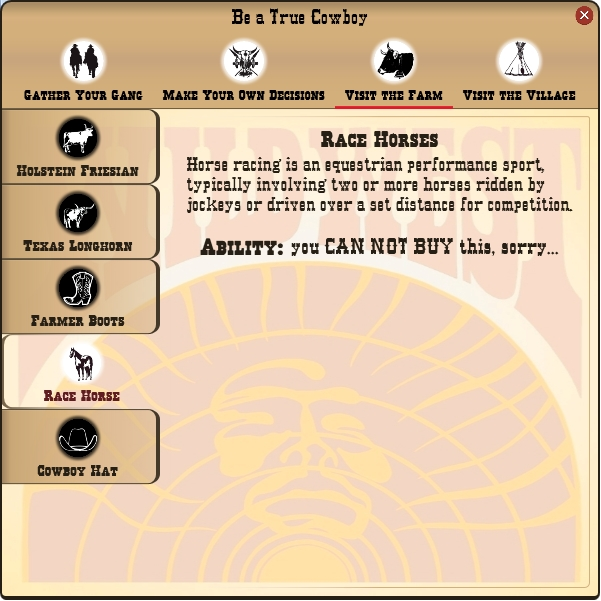
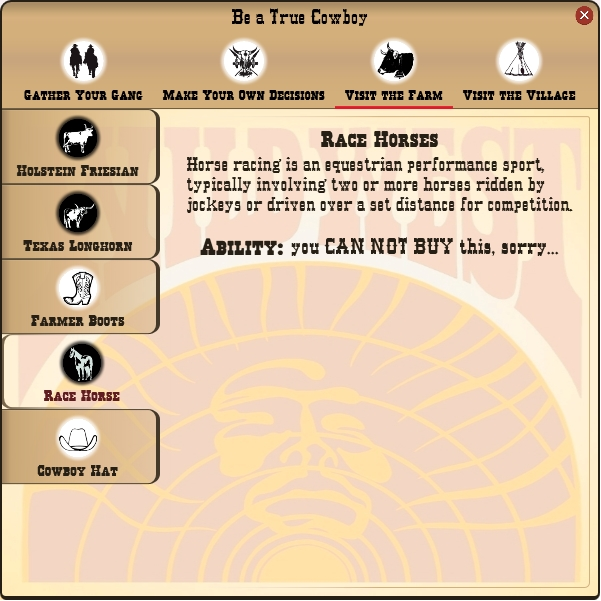
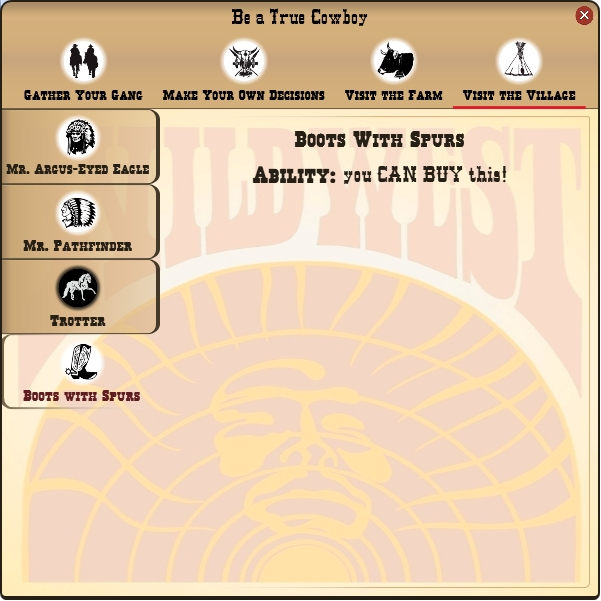
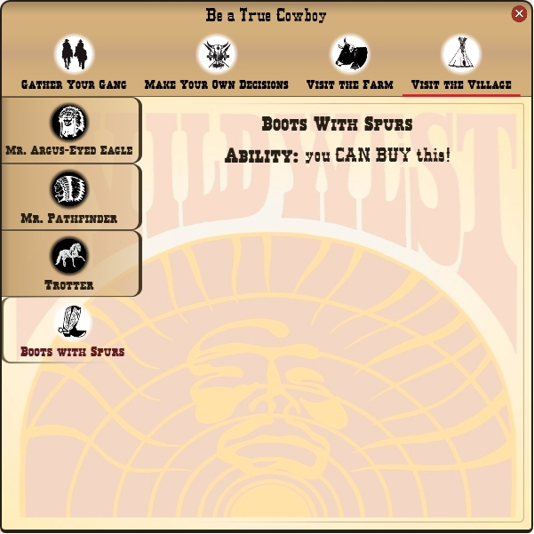
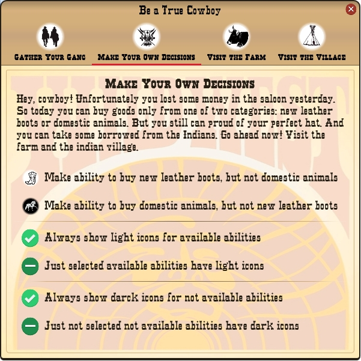
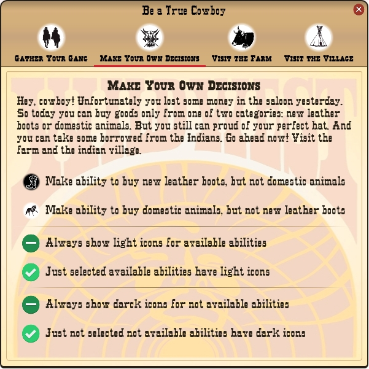

# Демонстративное приложение "Будь настоящим ковбоем" (BeATrueCowboy)

## Назначение программы
Это приложение для демонстрации пользовательских элементов интерфейса, созданных с помощью WPF:
- компонент, который хранит информацию об изображении и подписи;
– не визуальный компонент, выполняющий роль многофункционального
переключателя, контролирующего другие элементы управления;
- переключатель с подписью;
- переключатель панелей с нижним подчёркиванием в стиле Windows 10;
- многофункциональный боковой переключатель панелей;
- элемент управления пользовательского профиля.

## Средства разработки
- **Среда разработки**: Microsoft Visual Studio 2015.
- **Программная платформа**: Microsoft .NET Framework 4.5. с подсистемой Windows Presentation Foundation(WPF).
- **Языки программирования**: C# 6.0, XAML.
- **Операционная система**: Windows 7, Windows 10.

## Описание работы программы
Приложение представляет собой стилизованную форму. Её можно перетаскивать за заголовок, закрывать, но не изменять размеры.
Под заголовком - 4 переключателя LowerBandToggleControl, с которыми ассоциированы панели ниже.

### Вкладка "Gather Your Gang" (Собери свою банду)

Здесь 2 элемента UserProfileControl (Ковбой и Лошадь) и 1 элемент LabledToggleControl "Add a new member to your gang" для добавления других пользователей в свою банду.
В банду могут добавиться ещё 2 пользователя - Индеец и Койот.
Когда в банде набирается четверо, LabledToggleControl исчезает, иначе этот элемент присутствует.
Ковбоя и Лошадь нельзя удалять, а Индейца и Койота - можно.
Лидером может быть только Ковбой или Индеец, а Лошадь и койот - нет.

### Вкладки "Visit the Farm" (Посети ферму) и "Visit the Village" (Посети индейскую деревню)

Ковбою предлагается посетить Ферму и Индейскую деревню, но денег у него не так много. В этом путешествии на пути попадаются:
- индейцы,
- домашние животные: крупный рогатый скот и лошади;
- недорогие вещи (ковбойская шляпа);
- добротные и дорогие кожаные сапоги.

Потенциальные возможности Ковбоя:
- у индейцев можно занять денег, всегда, но совсем немного;
- на недорогие вещи деньги есть всегда;
- можно приобрести либо домашних животных, либо сапоги, но не то и другое одновременно.

На каждой из вкладок "Visit the Farm" и "Visit the Village" ковбою предлагается реализовать ряд возможностей.
Каждая возможность представлена переключателем SideToggleControl.
Возможности можно просматривать на каждой из этих вкладок по одной, выбирая соответствующий SideToggleControl.
На ассоциированной с SideToggleControl панели появляется информация и подпись в конце о состоянии возможности ("Ability: ..."):
 - "you CAN BOY this!" (вы можете купить это) - возможность есть;
 - "you CAN NOT BUY this, sorry..." (вы не можете это купить) - возможности нет;
 - "you can borrow some money from him." (вы можете занять немного денег у него) - относится к индейцам, возможность есть.
Обычно, чтобы просмотреть возможность и нажать при этом на соответствующий SideToggleControl, его картинка будет светлой, а другие возможности, которые в данный момент не просматриваются, имеют тёмные иконки.

### Вкладка "Make Your Own Decisions" (Прими решения)

Здесь есть 3 группы, каждая из которых состоит из 2 элементов LabledToggleControl.

**Группа 1.** Здесь Ковбою предлагается принять решение, что он будет делать из крупных покупок, домашних животных или сапоги:
выбранное решение помечается светлой иконкой - эти возможности будут доступными, недоступные возможности здесь помечены тёмной иконкой.

**Группа 2.** Здесь можно сделать так, чтобы элементы SideToggleControl всех доступных возможностей всегда отображали только светлые иконки,
даже, если эти возможности в данный момент не просматриваются.
Иначе, как обычно, выбранная возможность - со светлой иконкой, не выбранная - с тёмной.

**Группа 3.** Здесь можно сделать так, чтобы элементы SideToggleControl всех недоступных возможностей всегда отображали только тёмные иконки, даже, если эти возможности в данный момент просматриваются.
Иначе, как обычно, выбранная возможность - со светлой иконкой, не выбранная - с тёмной.

## Описание пользовательских элементов управления
1. **LabeledImageDataControl** - компонент, который хранит информацию:
	- источник изображения;
	- стиль изображения;
	- подпись;
	- стиль подписи.

2. **SimpleToggleControl** – не визуальный компонент, выполняющий роль переключателя. Контролирует другие элементы:
	- элемент, который показывается в активном состоянии переключателя;
	- элемент неактивного состояния;
	- элемент hit-области (области фокуса переключателя);
	- ассоциированный элемент, который будет видимым, если переключатель активен, обычно это панель, тогда SimpleToggleControl управляет вкладками.
	Имеет состояния:
	- выбранный или нет;
	- доступный или нет.
	Также у него ест индекс группы: в пределах глобальной группы, которая может состоять из различных SimpleToggleControl, находящихся в разных местах, с одинаковым индексом может быть выбран только один элемент.
	Переключатели с неопределённым индексом - сами по себе, вне групп.
	Если элементами активного и неактивного состояния являются элементы LabeledImageDataControl, то для них есть ещё 2 возможности:
	- показывать ли всегда активное изображение для доступных элементов;
	- показывать ли всегда неактивное изображение для недоступных элементов.

3. **LabledToggleControl** - переключатель с подписью. Содержит:
	- SimpleToggleControl;
	- 2 изображения в качестве активного и неактивного элементов;
	- подпись.
	Можно менять изображения, надпись, индекс группы и отслеживать выбранное состояние переключателя.

4. **LowerBandToggleControl** - переключатель панелей с нижним подчёркиванием в стиле Windows 10. Содержит:
	- SimpleToggleControl;
	- LabeledImageDataControl в качестве hit-области (то есть при переключении изображение и надпись не меняются, но являются областью фокуса);
	- 2 небольшие полоски: одна, закрашенная, появляется внизу в активном состоянии; другая, прозрачная - для неактивного состояния.
	Можно менять изображение, подпись, делать подпись поуже за счёт небольшого уменьшения шрифта, привязывать ассоциированный элемент, устанавливать индекс группы и отслеживать выбранное состояние переключателя.

5. **SideToggleControl** - переключатель панелей, имеющий внешний вид для удобного бокового расположения. Содержит:
	- SimpleToggleControl;
	- 2 элемента LabeledImageDataControl для активного и неактивного состояний.
	Можно использовать все возможности SimpleToggleControl и LabeledImageDataControl, а также делать подпись поуже за счёт небольшого уменьшения шрифта.

6. **UserProfileControl** - элемент пользовательского профиля. Содержит:
	- изображение пользователя;
	- заголовок и значение имени;
	- заголовок и значение псевдонима;
	- SimpleToggleControl и 2 управляемых им изображения для пометки пользователя в качестве избранного;
	- SimpleToggleControl и 2 управляемых им изображения для удаления профиля.
	Можно менять изображение пользователя, имя, псевдоним, устанавливать индекс группы, назначать пользователя избранным в пределах своей группы, удалять профиль, а также устанавливать возможности: может ли пользователь быть избранным и может ли его удалять.

## Статус проекта
Проект завершён.

## Контакты
Котова Екатерина Александровна,
e-mail: katekotova_86@mail.ru